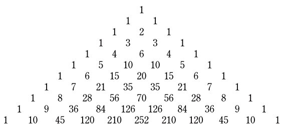
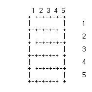

# 입사 문제
---------------------------
## 문제1.
**다음과 같은 삼각형 모양으로 수를 배열한 것을 일명 파스칼의 삼각형이라 합니다.  
`높이가 8인 삼각형의 모든 수의 값을 합하면 얼마인지 출력하는 프로그램`을 작성하세요.**


## 문제2.
**1부터 n까지의 자연수를 차례로 더하여 구해진 값을 삼각수라고 합니다.  
예를 들어 7번째 삼각수는 `1 + 2 + 3 + 4 + 5 + 6 + 7 = 28` 이 됩니다.  
이런식으로 자연수의 배열을 삼각수로 구해 나가면 다음과 같습니다.
`1, 3, 6, 10, 15, 21, 28 ,36, 45, 55, ...` 
다시 이 삼각수들의 약수를 각각 구하면 다음과 같습니다.**
```
1: 1
3: 1, 3
6: 1, 2, 3, 6
10: 1, 2, 5, 10
15: 1, 3, 5, 15
21: 1, 3, 7, 21
28: 1, 2, 4, 7, 14, 28 
      ...
```
**위에서 보면, 5개 이상의 약수를 갖는 첫번째 삼각수는 28 입니다.
그러면 500개 이상의 약수를 갖는 첫번째 삼각수는??   
프로그램 작성 하세요** *(오일러 12번문제)*

## 문제3.
**입력된 숫자 배열을 다음과 같은 형태의 배열로 순서를 변경하는 프로그램을 작성하세요.**
`[a1, a2, a3..., an, b1, b2, b3..., bn]     >>  [a1, b1, a2, b2, a3, b3..., an, bn]`
```
입력: 1 2 3 4 5 6 7 8
출력: 1 5 2 6 3 7 4 8
```
## 문제4.
**디지털 시계에 하루동안(00:00 ~ 23:59) `3` 이 표시되는 시간을 초로 환산하면 총 몇 초 입니까?  
 디지털 시계는 하루동안 다음과 같이 시:분 (00:00 ~ 23:59)으로 표시됩니다. 입력없이 결과(초)를 출력하는 프로그램을 작성하세요.**

## 문제5. 
### 목표 숫자에 맞게 연산하기
**숫자 배열과 목표 숫자가 주어지면, 목표 숫자가 연산 결과로 나올 수 있도록 숫자 배열을 이용한 연산 수식을 출력하는 프로그램을 작성하세요.  
`단, 숫자 배열 사이에 연산자는 덧셈(+)과 뺄셈(-)만 사용가능하며, 배열의 순서는 변경하지 않습니다.`**

```
입력: 1 3 4 5, 7
출력: 1 - 3 + 4 + 5
```
[참고문제] 1부터 9까지의 연속된 수를 `+`나  `-`를 사용하여 합계가 100이 되는 전체 수를 구하시오.
ex) 1 + 2 + 3 - 4 + 5 + 6 + 78 + 9 = 100
[출처](http://codingdojang.com/scode/463)

## 문제6.
### 한글 검사하기
**UTF8로 인코딩 된 문자열에서 한글초성으로만 된 문자가 포함된 경우 `true`를, 그렇지 않으면 `false`를 출력하는 프로그램을 작성하시오.**

```
입력: 하하 ㅋㅋ
출력: true
입력: 안녕하세요
출력: false
```
## 문제7. 
### 미로를 만들기
**입력된 숫자 `N`에 대하여 `N*N` 크기의 격자로 된 미로를 만드는 프로그램을 작성하시오. 모든 격자를 통과하는 하나의 경로를 가지고 있어야 하며  
입구는 `(1, 1)`위쪽이며 출구는 `(N, N)`아래 이다. 격자 모서리는 `+`로 표기하며 벽은 `-` 와 `|`를 사용한다.**
```
입력: 5
출력:아래 이미지
```


[참고문제] 높이와 폭의 길이를 입력받아 임의의 미로를 출력하는 프로그램입니다. 미로는 프로그램을 실행할 때마다 다르게 출력되어야 하며 코너는 `+`로, 수직벽은 `|`를 사용하여야 합니다.  
출구는 벽면이 없는 형태로 출력하고, 현재위치는 #으로 표기합니다. 단 현재위치와 출구는 반드시 연결되어야 합니다.

## 문제8. 
### 헥사값 구하기
**ASCII CODE 문자열 `"Hello World!"`의 `(A)[byte단위 xor 값]`과 `(B)[byte단위 합계]`를 구하여 `상위 8bit는 (A)로 채우고, 하위 24bit는 (B)로 채운 Integer 값을 Hex값으로` 프로그램하고 결과를 출력하시오.**

## 문제9.
### 표 숫자에 맞게 연산하기
**아래 □칸에 두가지 연산자 `(+, -)`만을 넣어 결과가 0인 수식을 만들고자 합니다.**
```
□ 1 □ 6 □ 7 □ 6 □ 1 □ 4 □ 5 = 0
```
**이러한 만족하는 수식을 모두 몇개 만들 수 있을지 출력하는 프로그램을 작성하세요.**
[참고문제] 위의 문제5.

## 문제10.
### 비트 출력
**어떤 `32bit unsigned integer` 값을 입력 받으면, 이것의 모든 비트에 대해 `0을 1로` 바꾸고 `1을 0으로 바꾼` 수를 리턴해주는 함수 InverseBits를 작성하고, `InverseBits(123456789)`를 출력 하는 프로그램을 작성하세요.**

## 문제11.
### 비트 연산
**Intel CPU 기반에서,  
IEEE 32bit floating point는 Mantissa(Significand) 23bit, Exponent 8bit, Sign 1bit로 표현하며,   
IEEE 16bit floating point는 Mantissa(Significand) 10bit, Exponent 5bit, Sign 1bit로 표현합니다.  
32bit floating point의 Mantissa를 구하는 함수 `unsigned int GetMantissa32(float value)`와  
16bit floating point의 Mantissa를 구하는 함수 `unsigned int GetMantissa16(float value)`를 작성하고**  

**`GetMantissa32(3.14194989) + GetMantissa16(3.14194989)`의 값을 출력하는 프로그램을 작성하세요.**
```
두 함수는 32bit floating point로 입력 받으며, 리턴값은 각각 최대 2^23-1, 2^10-1 입니다.
```

